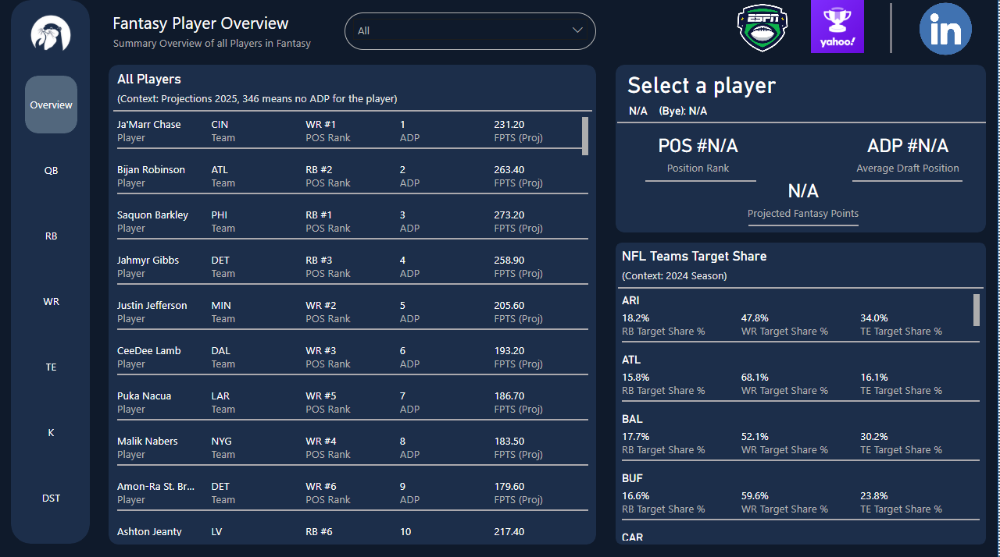
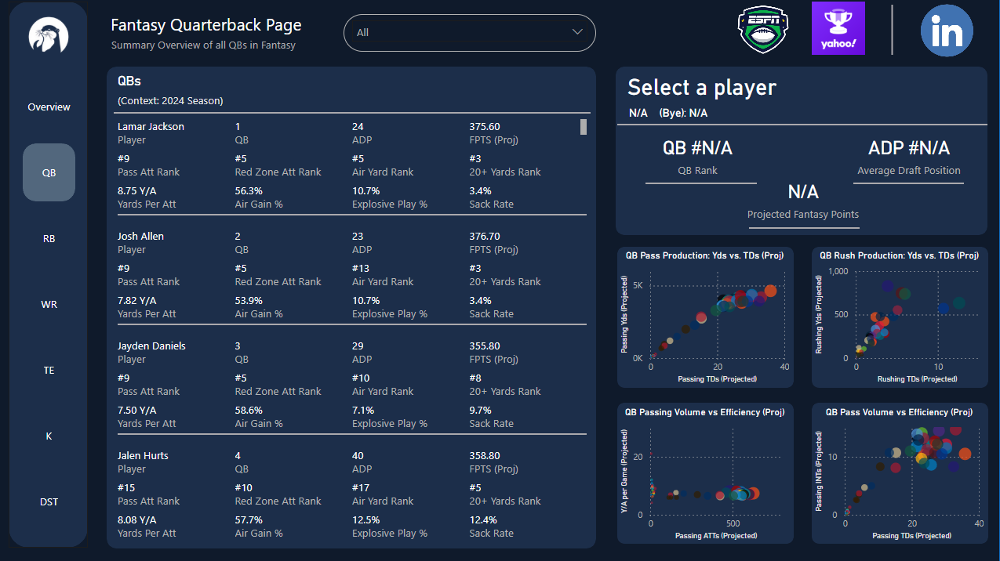
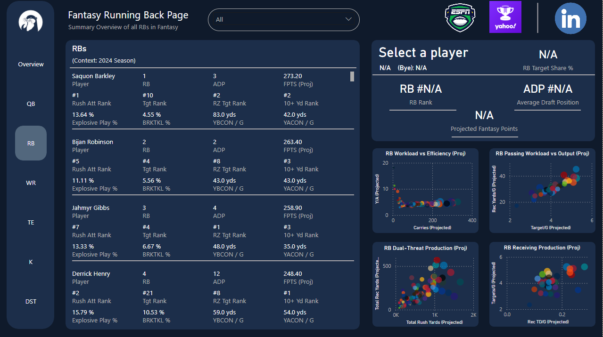
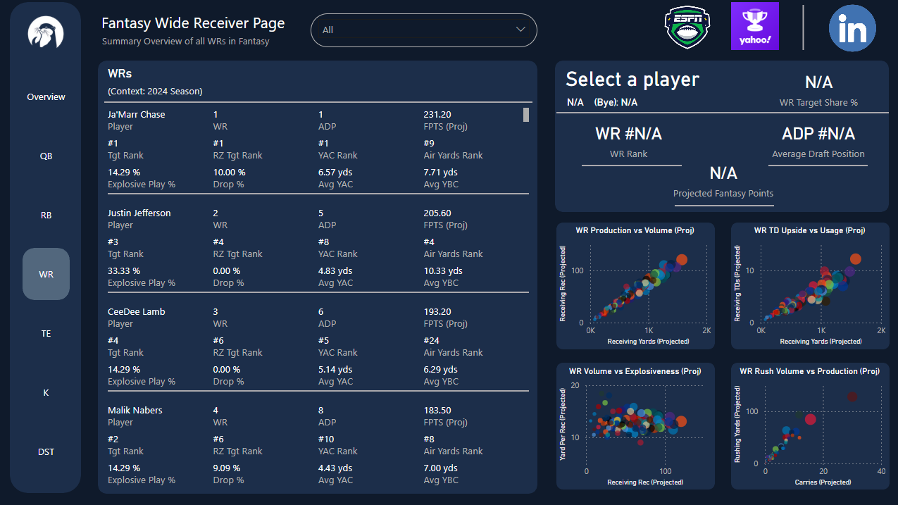
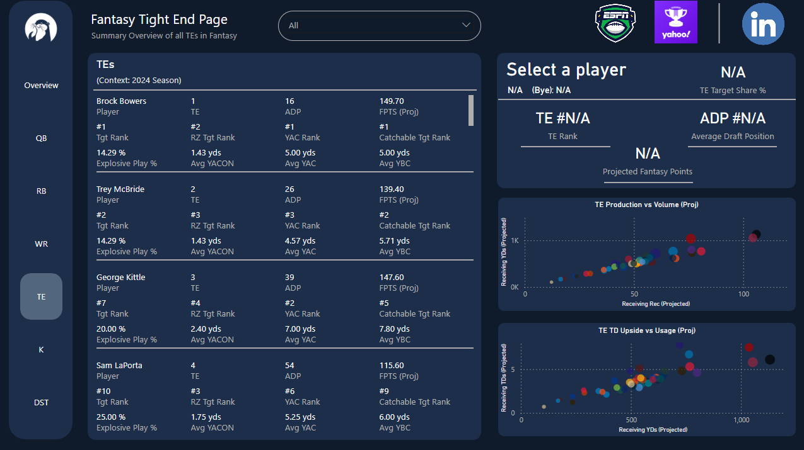
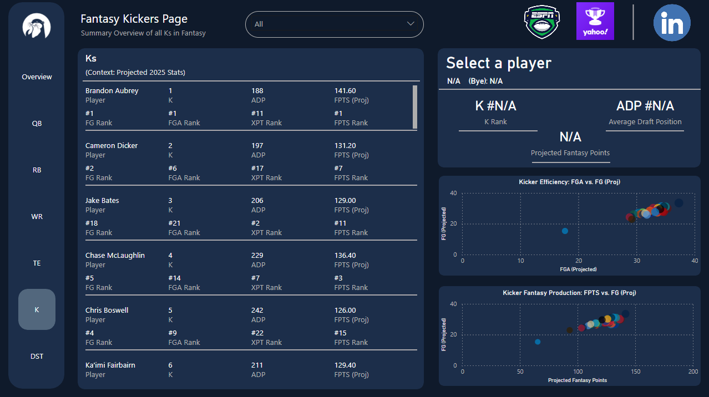
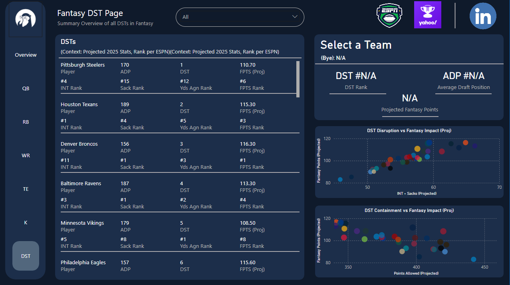

# NFL Fantasy Dashboard – Power BI  

## Project Overview  
This project is an interactive Power BI dashboard analyzing NFL fantasy football data across players, positions, and teams. The goal was to identify key trends in player usage, scoring efficiency, and team-level target distribution, thereby supporting data-driven decision-making for fantasy football managers.  

---

## Data Source  
Data was collected from FantasyPros, combining player- and team-level statistics, including:  
- Player information: name, position, team, bye week  
- Fantasy projections (PPR format) and average draft position (ADP)  
- Historical performance metrics (2024 season)  
- Advanced usage metrics: team target share, red-zone opportunities, snap counts  

The final dataset included 400+ players/fantasy entities across all NFL teams.  

---

## Key Insights  

- **Wide Receiver (WR) Target Share – Top 5:** Los Angeles Rams (74.5%), New York Giants (72.6%), Chicago Bears (72.1%), Indianapolis Colts (71.5%), Atlanta Falcons (68.1%)  
  *Insight:* Identifies WRs with the most passing opportunities, translating into higher fantasy scoring potential. Multi-card visuals also include **positional statistics from the 2024 season** such as Yards per Attempt (Y/A), explosive play percentage, yards after catch, and broken tackle rate for context.  

- **Running Back (RB) Target Share – Top 5:** New Orleans Saints (26.1%), Pittsburgh Steelers (23.7%), Miami Dolphins (23.1%), Tampa Bay Buccaneers (21.5%), Denver Broncos (21.4%)  
  *Insight:* Valuable for PPR leagues, as higher reception opportunities increase scoring potential. Multi-card visuals display **usage metrics** including rushing attempts, receptions, and receiving targets.  

- **Efficiency & Production Insights:** Scatter plots compare **production versus efficiency** across positions. For dual-threat players (QB, RB, WR), metrics include passing, rushing, and receiving contributions. For defense, metrics include sacks, interceptions, and points allowed from the previous season, which help identify impactful players.  

- **Positional Rankings & Key Metrics:** Multi-card visuals rank players on key positional metrics for **quick comparison**. Charts integrate advanced statistics, including **dual-threat usage, efficiency per opportunity, and defensive disruption**, making it easy to evaluate both raw production and efficiency.  

- **Digestibility for All Users:** Even users unfamiliar with advanced analytics can quickly assess player value through the multi-card visuals and scatter plots, which combine historical stats, projected points, and usage data for actionable fantasy insights.  
 
---

## Interactive Features  

- **Player Selection Multi-Cards:** Select a player to highlight their ADP, position rank, projected points, and target share, as well as see the player highlighted across scatter plots.  
- **Team Target Share Multi-Cards:** On the overview page, select a team to highlight all players’ performance and usage metrics.  
- **Scatter Plots:** Clicking on a player pulls up their performance and projections for the year, enabling interactive comparisons.  
- **Navigation & Search:** Vertical navigation bar, search slicer by player, and direct links to ESPN Fantasy and Yahoo Fantasy live draft projections.  

---

## Tools & Methods  

- **Python** – Web scraping from FantasyPros, data extraction, cleaning, and preparation  
- **Power BI Desktop** – Data modeling, DAX calculations, multi-card visuals, and interactive dashboard creation  
- **Excel/CSV** – Base data storage, validation, and preprocessing  

---

## Skills Highlight  

- Built an end-to-end ETL pipeline: scraped and extracted raw data, cleaned and transformed it into analysis-ready datasets, and loaded it into Power BI.
- Created **DAX measures** for usage metrics (e.g., target share, red-zone efficiency)
- Designed interactive multi-card visuals and scatter plots for intuitive player and team comparison.  
- Converted raw player statistics into actionable fantasy football insights through formatted multi-card visuals and scatter plots, enabling clear evaluation of player usage, efficiency, and projected scoring.  

---

## Dashboard Preview

## Positional Previews
### Quarterbacks (QB)

### Running Backs (RB)

### Wide Receivers (WR)

### Tight Ends (TE)

### Kickers (K)

### Defense/Special Teams (DST)

